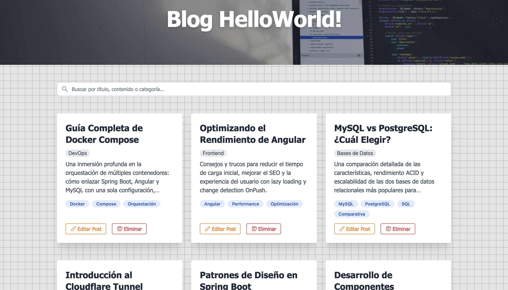
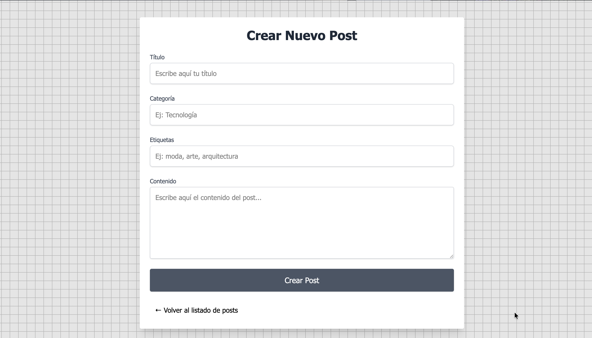
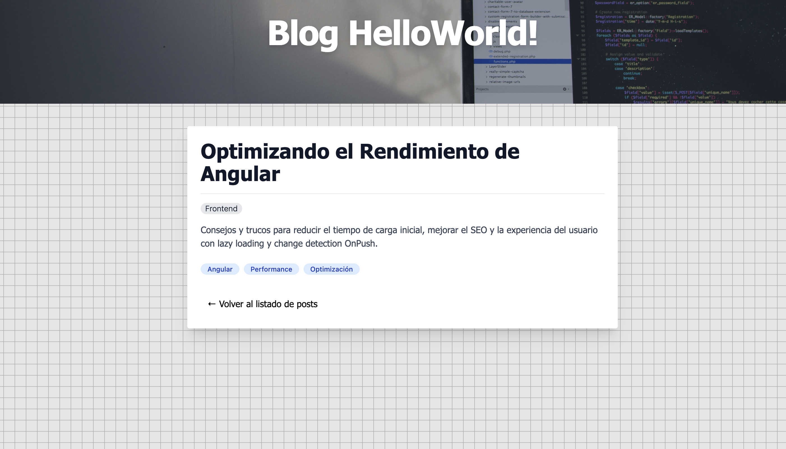
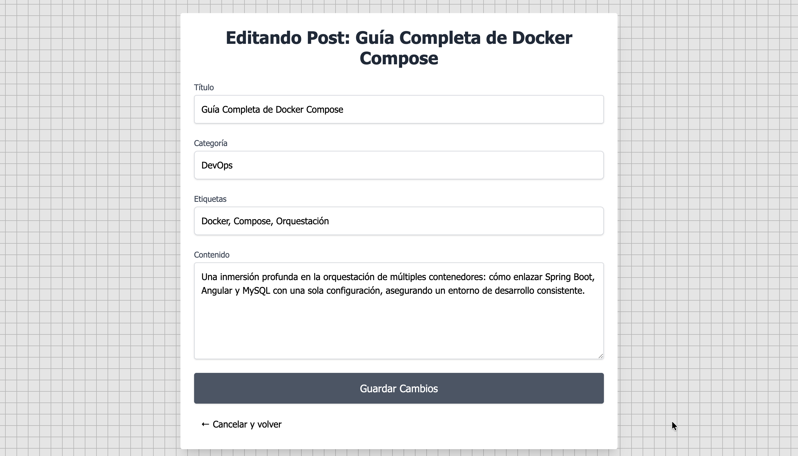

# Blog Full-Stack con Spring Boot, Angular y MySQL

Aplicación de blog con operaciones CRUD completas sobre posts, búsqueda en tiempo real y despliegue contenedorizado con Docker Compose. El proyecto separa frontend, backend y base de datos en servicios independientes, con NGINX como punto de entrada para la SPA.

## Demo

- App: `https://blog-helloworld.cesarmilandev.com/`
- API: `https://blog-helloworld-api.cesarmilandev.com/api/posts`

## Quick Start

```bash
docker compose up -d --build
```

Accesos principales:

| Servicio | URL |
|---|---|
| Frontend local | `http://localhost:4201` |
| Backend local | `http://localhost:8084/api/posts` |
| MySQL local | `localhost:3308` |
| Demo pública | `https://blog-helloworld.cesarmilandev.com/` |

## Stack

| Capa | Tecnología |
|---|---|
| Frontend | Angular 21 |
| Estilos | Tailwind CSS 4 |
| Backend | Spring Boot 4, Spring Web MVC, Spring Data JPA |
| Base de datos | MySQL 8 |
| Proxy | NGINX |
| Contenedorización | Docker Compose |

## Qué hace la aplicación

- Lista posts en tarjetas con navegación a detalle.
- Permite buscar por título, contenido o categoría.
- Crea nuevos posts desde formulario.
- Edita posts existentes.
- Elimina posts con confirmación modal.
- Muestra categorías y etiquetas por entrada.

## Capturas

### Listado de posts



### Crear post



### Detalle de post



### Editar post



## Arquitectura

```text
blog-serv/
├── backend/              # API REST y persistencia
├── frontend/             # SPA Angular y build para NGINX
├── docs/screenshots/     # Capturas del proyecto
└── docker-compose.yml    # Orquestación de servicios
```

Flujo de ejecución:

1. El navegador consume la SPA servida por NGINX.
2. NGINX reenvía las peticiones `/api/*` al servicio `spring-app`.
3. Spring Boot accede a MySQL mediante JPA.

## Rutas y experiencia de usuario

Rutas principales del frontend:

- `/`: listado de posts
- `/create`: creación de post
- `/post/:id`: detalle de un post
- `/post/edit/:id`: edición de un post

Comportamientos implementados:

- Búsqueda con `debounce` de 300 ms para evitar peticiones excesivas.
- Actualización del listado tras crear un post.
- Confirmación antes de eliminar.
- Soporte de rutas SPA en NGINX mediante `try_files`.

## API REST

Base local: `http://localhost:8084/api/posts`

| Método | Ruta | Descripción |
|---|---|---|
| `GET` | `/api/posts` | Lista todos los posts |
| `GET` | `/api/posts?term=angular` | Busca por título, contenido o categoría |
| `GET` | `/api/posts/{id}` | Recupera un post por id |
| `POST` | `/api/posts` | Crea un post |
| `PUT` | `/api/posts/{id}` | Actualiza un post |
| `DELETE` | `/api/posts/{id}` | Elimina un post |

Ejemplo de payload:

```json
{
  "title": "Optimizando el Rendimiento de Angular",
  "content": "Consejos y trucos para reducir el tiempo de carga inicial...",
  "category": "Frontend",
  "tags": "Angular, Performance, Optimizacion"
}
```

## Modelo de datos

Cada post contiene:

- `id`
- `title`
- `content`
- `category`
- `tags`

Validaciones actuales en backend:

- `title`, `content`, `category` y `tags` son obligatorios
- `content` admite hasta 20.000 caracteres

## Requisitos

- Docker y Docker Compose
- Java 21 para ejecutar el backend en local
- Node.js 20 o superior para ejecutar el frontend en local

## Ejecución con Docker

Desde la raíz del proyecto:

```bash
docker compose up -d --build
```

Parar el entorno:

```bash
docker compose down
```

Servicios definidos en `docker-compose.yml`:

- `mysql`: base de datos con volumen persistente `db-data`
- `spring-app`: API REST en Spring Boot
- `angular-web`: build Angular servido con NGINX

## Desarrollo local

### Backend

El `application.properties` actual está preparado para Docker y usa `mysql:3306` como host. Si ejecutas Spring Boot fuera de contenedores, debes adaptar la conexión al puerto publicado por Docker (`localhost:3308`) o usar una configuración específica para local.

```bash
cd backend
./mvnw spring-boot:run
```

### Frontend

```bash
cd frontend
npm install
npm start
```

El servidor de desarrollo arranca por defecto en `http://localhost:4200`.

Nota importante:

- El `environment` actual del frontend apunta a `https://blog-helloworld-api.cesarmilandev.com`, incluso en desarrollo. Si quieres trabajar completamente en local, conviene ajustar esa URL o introducir entornos separados.

## Configuración relevante

- `docker-compose.yml`: define puertos, red interna y dependencias entre servicios
- `frontend/nginx.conf`: proxy inverso de `/api/` a `spring-app:8080` y fallback SPA a `index.html`
- `backend/src/main/resources/application.properties`: datasource JDBC y configuración JPA

## Testing

Cobertura actual:

- Backend: test base de carga de contexto con Spring Boot
- Frontend: configuración de test disponible en Angular, sin tests funcionales destacados en este estado

## Decisiones técnicas

- NGINX permite servir el build del frontend y actuar como proxy inverso hacia la API.
- Docker Compose simplifica el arranque coordinado de frontend, backend y base de datos.
- Spring Data JPA reduce el código manual de acceso a datos y facilita la consulta por término.
- Angular organiza la UI en componentes separados para listado, detalle, creación, edición y confirmación.

## Posibles mejoras futuras

- Autenticación y autorización para proteger operaciones de escritura
- Paginación y ordenación en el listado
- Subida de imágenes para posts
- Validaciones de formulario más completas en frontend
- Tests de integración y e2e
